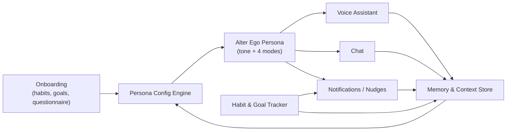
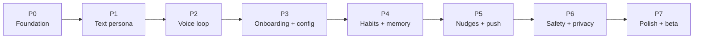

# Alter EGO — Functional & Non-Functional Requirements

A mobile, voice-first AI companion that acts as the user's "alter ego / inner self." After onboarding (habits, goals, questionnaire), it configures a personalized persona that switches between four guidance modes: Brutal Honesty, Roast, Motivation, and Emotional Support. Interaction happens through voice, chat, and proactive notifications. Cloud AI APIs power LLM reasoning, speech-to-text (STT), and text-to-speech (TTS).

> **Note:** The working product name in the UI prototype is **Kagevo** (`kagevo.app`). This document uses the original **Alter EGO** requirements naming.

## Build Phases

| Phase | Scope |
|-------|--------|
| **0 — Foundation** | Turborepo (Expo app + Hono Worker + shared types), Supabase (Auth/Postgres/pgvector/Storage), streaming Gemini hello-world, Sentry + CI + EAS dev build |
| **1 — Text persona** | Persistent history, 4 modes + intensity dial, manual mode switch, Gemini primary + Groq fallback |
| **2 — Voice loop** | expo-audio record → Groq Whisper STT → LLM → expo-speech + Edge TTS, push-to-talk, live transcript, shared voice/chat context |
| **3 — Onboarding** | Questionnaire + habits + goals capture, voice/name picker, generate editable persona profile |
| **4 — Habits & memory** | Logging + streaks + progress, pgvector semantic memory recall, memory viewer with edit/delete |
| **5 — Nudges & push** | Local scheduled reminders, server-side persona nudges via Cron + Expo Push/FCM, controls + deep-link |
| **6 — Safety & privacy** | Roast/brutal guardrails, crisis detection + helplines, consent/export/delete, sensitive turns to no-train provider |
| **7 — Polish & beta** | Adaptive tone, accessibility, PostHog analytics + persona A/B, cost caps/caching, closed beta (TestFlight + Play internal) |

## 1. Product Summary

- **Platforms:** iOS + Android (native or cross-platform mobile).
- **Core loop:** Onboard → configure persona → daily voice/chat interactions + proactive nudges → track habits/goals → persona adapts over time.
- **AI:** Cloud LLM for reasoning/persona, cloud STT for voice input, cloud TTS for spoken replies.

## 2. User Roles

- **End user (primary):** configures persona, interacts, tracks habits/goals.
- **(Future) Admin/ops:** manages safety policies, content moderation, model config. Out of MVP scope but NFRs should not preclude it.

## 3. Functional Requirements (FR)

### FR-1 Onboarding & Persona Configuration

- FR-1.1 Capture user habits the user wants to build/break (name, frequency, target time, why it matters).
- FR-1.2 Capture goals (short-term and long-term) with target dates and success criteria.
- FR-1.3 Present a structured questionnaire to profile personality, motivation style, communication preferences, triggers, and emotional baseline.
- FR-1.4 Let the user choose default persona tone/intensity and which of the 4 modes are enabled (Brutal, Roast, Motivation, Emotional Support).
- FR-1.5 Let the user select/preview the assistant voice (gender, accent, pace) and a persona name.
- FR-1.6 Generate a persona config profile from the above that drives system prompts, tone, mode-switching rules, and notification cadence.
- FR-1.7 Allow re-running onboarding or editing any answer/config later from settings.

### FR-2 Voice Assistant

- FR-2.1 Voice input: capture speech and transcribe via cloud STT (push-to-talk and/or wake/hands-free).
- FR-2.2 Voice output: speak responses via cloud TTS in the selected persona voice.
- FR-2.3 Maintain a continuous spoken conversation with turn-taking and barge-in (user can interrupt).
- FR-2.4 Respect the active persona mode and intensity in spoken tone and word choice.
- FR-2.5 Show a live transcript of the voice conversation.
- FR-2.6 Handle no-input/low-confidence transcription gracefully (re-prompt, fallback to text).

### FR-3 Chat

- FR-3.1 Text chat with the same persona/context as voice (shared memory).
- FR-3.2 Persistent, scrollable conversation history.
- FR-3.3 In-chat control to switch persona mode (e.g., "roast me" vs "support me") and intensity.
- FR-3.4 Support quick actions / suggested prompts tied to active habits and goals.
- FR-3.5 Seamless switch between voice and chat within the same session/context.

### FR-4 Persona Modes (Inner-Self Behavior)

- FR-4.1 **Brutal Honesty:** direct, no-sugarcoat feedback grounded in the user's stated goals and tracked behavior.
- FR-4.2 **Roast:** humorous, sharp callouts when the user slacks — bounded by user-set intensity and safety limits.
- FR-4.3 **Motivation:** encouragement, reframing, and action prompts toward goals.
- FR-4.4 **Emotional Support:** empathetic, validating, calming responses.
- FR-4.5 Automatic and manual mode selection: persona picks an appropriate mode from context, and the user can override at any time.
- FR-4.6 A user-controllable "intensity" dial that bounds how brutal/roasting the persona gets.

### FR-5 Habit & Goal Tracking

- FR-5.1 Log habit completions/misses (manual check-in; optional reminders).
- FR-5.2 Track goal progress and milestones.
- FR-5.3 Show streaks, progress summaries, and history.
- FR-5.4 Tracking data feeds the persona so feedback is grounded in real behavior (e.g., roast when a streak breaks, support when struggling).

### FR-6 Notifications & Proactive Nudges

- FR-6.1 Scheduled reminders for habits/goals based on configured times.
- FR-6.2 Proactive, persona-flavored nudges (motivational push in the morning, accountability check-in if a habit is missed).
- FR-6.3 Notification content adapts to active mode/intensity and recent behavior.
- FR-6.4 User controls: per-category toggles, quiet hours, frequency caps, and full opt-out.
- FR-6.5 Tapping a notification deep-links into the relevant chat/voice context.

### FR-7 Memory & Personalization

- FR-7.1 Persist key facts: goals, habits, preferences, recurring themes, prior conversations.
- FR-7.2 Use memory to keep persona consistent and context-aware across sessions and across voice/chat.
- FR-7.3 Adapt tone/cadence over time based on engagement and outcomes.
- FR-7.4 Let the user view, edit, and delete stored memories/facts.

### FR-8 Account, Settings & Data Control

- FR-8.1 Account creation/auth and secure sign-in.
- FR-8.2 Settings for persona, voice, modes, intensity, notifications, and privacy.
- FR-8.3 Export and delete account/data (privacy compliance).
- FR-8.4 Manage AI/data consent (what is stored, what is sent to cloud AI).

### FR-9 Safety & Wellbeing Guardrails

- FR-9.1 Roast/brutal modes must never cross into harassment, hate, or content targeting protected attributes.
- FR-9.2 Detect signals of crisis/self-harm and switch to a safe, supportive response with appropriate helpline resources, regardless of active mode.
- FR-9.3 Hard content limits independent of intensity dial; user can always dial down or pause.
- FR-9.4 Clear disclaimer that Alter EGO is not a medical/mental-health professional.

## 4. Non-Functional Requirements (NFR)

### NFR-1 Performance & Latency

- Voice round-trip (speech end → spoken reply start) target **< 1.5s p50**, **< 3s p95**.
- Chat response start **< 1s p50**; stream tokens as generated.
- App cold start **< 3s** on mid-tier devices.

### NFR-2 Reliability & Availability

- Target **99.9% uptime** for backend AI gateway.
- Graceful degradation: if voice/STT/TTS fails, fall back to text; queue notifications if delivery fails.
- Offline: show cached history, habits, and allow manual check-ins; sync when back online.

### NFR-3 Scalability

- Stateless API gateway that scales horizontally; per-user memory store scales to large user counts.
- Handle bursty traffic (e.g., morning notification waves) without latency regressions.

### NFR-4 Security

- Encryption in transit (TLS) and at rest for personal data and conversation memory.
- Secure auth (token-based), no secrets in client; least-privilege access to AI provider keys server-side.
- Audit logging for sensitive operations and data access.

### NFR-5 Privacy & Compliance

- Privacy-by-design; explicit consent for storing conversations and sending data to cloud AI.
- GDPR/CCPA-style rights: export, delete, and view stored data (supports FR-8.3, FR-7.4).
- Data minimization and configurable retention windows for conversation history.

### NFR-6 Usability & Accessibility

- Voice-first but fully usable via text/touch.
- Accessibility: screen-reader support, dynamic font sizes, captions/transcripts for all voice, sufficient contrast.
- Smooth, low-friction onboarding (clear progress, skip/return).

### NFR-7 Safety & Content Quality (non-functional aspects)

- Consistent enforcement of safety guardrails (FR-9) with measurable false-negative targets for crisis detection.
- Persona consistency across sessions and modalities.

### NFR-8 Cost & Efficiency

- Monitor and cap per-user AI spend (LLM/STT/TTS tokens/minutes); configurable budgets and rate limits.
- Cache and reuse where safe (e.g., TTS for repeated notification copy) to reduce cost.

### NFR-9 Observability

- Centralized logging, metrics, and tracing for latency, errors, AI provider failures, and notification delivery.
- Analytics on engagement, retention, mode usage, and habit/goal outcomes (privacy-respecting).

### NFR-10 Maintainability & Portability

- Provider abstraction so LLM/STT/TTS vendors can be swapped without app changes.
- Modular persona/prompt configuration that can be versioned and A/B tested.

### NFR-11 Localization (future-ready)

- Architecture should not block multi-language STT/TTS/LLM and localized UI later, even if MVP is single-language.

## 5. Phased MVP Build Roadmap

Sequenced to get a usable, talking Alter EGO in your hands as early as possible, then layer intelligence, proactivity, and polish. Each phase ends with something testable. Phases map to the FRs in section 3 and the stack in [TECH_STACK.md](./TECH_STACK.md).

### Phase 0 — Foundation & Plumbing

- Scaffold Turborepo monorepo: Expo app + Hono Worker gateway + shared TS types.
- Stand up Supabase (Auth + Postgres + pgvector + Storage); wire Supabase Auth sign-in/up in the app (FR-8.1).
- Hello-world streaming call app → gateway → Vercel AI SDK → Gemini, rendered in the app.
- Wire Sentry in app + Worker; create GitHub Actions (lint/typecheck/test) and an EAS dev build.
- **Exit:** authenticated user gets a streamed LLM reply on a real device.

### Phase 1 — Text Chat with Persona (core value)

- Chat UI with persistent history (FR-3.1, FR-3.2) stored in Postgres.
- Persona system-prompt engine with the 4 modes + intensity dial; manual mode switch in chat (FR-4.1–4.6, FR-3.3).
- Gemini primary + Groq fallback on rate-limit.
- **Exit:** you can chat and switch between brutal/roast/motivate/support tones. This is the first "is the magic there?" checkpoint.

### Phase 2 — Voice Loop (the headline feature)

- Record with expo-audio → gateway → Groq Whisper STT → transcript (FR-2.1, FR-2.5).
- LLM reply → on-device expo-speech TTS, then add Edge TTS streamed persona voice (FR-2.2).
- Push-to-talk first; live transcript; graceful no-input/low-confidence handling (FR-2.6); voice ↔ chat share one context (FR-3.5).
- **Exit:** full spoken conversation round-trip; measure latency against NFR-1.

### Phase 3 — Onboarding & Persona Configuration

- Questionnaire + habits + goals capture flow (FR-1.1–1.3).
- Voice/persona-name picker with preview; mode + intensity defaults (FR-1.4, FR-1.5).
- Generate persona config profile that drives prompts/cadence; editable later (FR-1.6, FR-1.7).
- **Exit:** a new user is onboarded into a personalized alter ego.

### Phase 4 — Habit/Goal Tracking & Memory

- Habit/goal logging, streaks, progress views (FR-5.1–5.3).
- pgvector semantic memory: persist + recall facts/themes; feed tracking data into persona so feedback is grounded (FR-5.4, FR-7.1–7.2).
- Memory viewer with edit/delete (FR-7.4).
- **Exit:** persona references your real behavior and past chats.

### Phase 5 — Proactive Notifications & Nudges

- Device-local scheduled habit reminders via expo-notifications (FR-6.1).
- Server-side persona-flavored nudges via Cloudflare Cron + Expo Push/FCM (FR-6.2, FR-6.3).
- Notification controls: per-category toggles, quiet hours, frequency caps (FR-6.4); deep-link into context (FR-6.5).
- **Exit:** Alter EGO reaches out unprompted, in character, respectfully.

### Phase 6 — Safety, Wellbeing & Privacy

- Safety guardrails on roast/brutal output; crisis/self-harm detection → supportive response + helpline resources regardless of mode (FR-9.1–9.4).
- Consent + data controls: AI/data consent, export, delete (FR-8.3, FR-8.4); retention windows (NFR-5).
- Route sensitive turns to no-train provider (Groq).
- **Exit:** ship-blocking safety/privacy requirements met.

### Phase 7 — Polish, Observability & Beta

- Adaptive tone over time (FR-7.3); accessibility pass — screen reader, dynamic fonts, captions (NFR-6).
- PostHog analytics on engagement/mode usage/outcomes + feature-flagged persona A/B (NFR-9, NFR-10).
- Cost caps/caching for LLM/STT/TTS to stay in free tiers (NFR-8); offline cached history (NFR-2).
- **Exit:** closed beta via TestFlight + Google Play internal testing.

### Suggested MVP cut line

**Minimum lovable MVP = Phases 0–3** (auth, persona chat, voice loop, onboarding). Phases 4–6 are the retention + trust layer that should land before any public release; Phase 7 is launch-readiness.

## 6. Key Assumptions & Open Items

- Cloud AI APIs are acceptable for sending conversation data (covered by consent in FR-8.4 / NFR-5).
- MVP language is single (e.g., English); multi-language is future (NFR-11).
- "Roast/brutal" tone is bounded by safety policy (FR-9) — this is the highest-risk area and needs explicit policy definition.
- Specific AI vendors, pricing, and exact latency budgets to be finalized during technical design (out of scope for this requirements doc).
