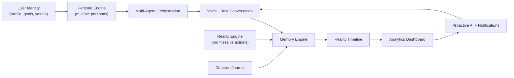
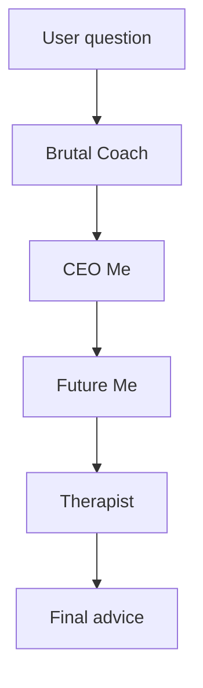
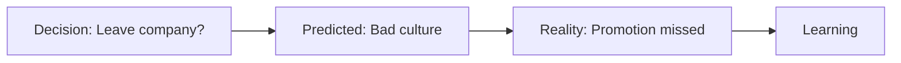
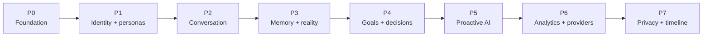

# Kagevo / Alter EGO — Product Requirements V2

A mobile, voice-first personal intelligence system that helps users understand who they are, who they want to become, and whether their real-world actions match their stated intentions. Users can create multiple AI personas, let those personas collaborate, track habits against a fixed set of life goals, journal decisions, and build a long-term Reality Timeline that compounds into personal context over time.

> **Note:** The working product name in the UI prototype is **Kagevo** (`kagevo.app`). Earlier docs used **Alter EGO** as the product name.

## Build Phases

| Phase | Scope |
|-------|--------|
| **0 — Foundation** | Turborepo (Expo app + Hono Worker + shared types), Supabase (Auth/Postgres/pgvector/Storage), streaming Gemini hello-world, Sentry + CI + EAS dev build |
| **1 — Identity + Personas** | Auth, profile, goals/values/personality, multiple personas, persona editing/cloning/deleting |
| **2 — Conversations** | Voice, text, streaming responses, conversation history, resume, interrupt, real-time transcription |
| **3 — Memory + Reality Engine** | Long-term memory, memory CRUD/search/summarization, promise/action tracking, accountability scores |
| **4 — Fixed Goals + Decision Journal** | Fixed goal tracks, habit tracking, reviews, milestones, decision prediction/outcome/reflection loops |
| **5 — Proactive AI + Notifications** | AI-initiated nudges, emotion-aware triggers, reminders, weekly/monthly reports |
| **6 — Analytics + Provider Management** | Life-area dashboard, AI routing/fallback/cost optimization, observability |
| **7 — Privacy + Timeline + Beta** | Data export/delete/consent, Reality Timeline, accessibility, closed beta |

## 1. Product Summary

- **Platforms:** iOS + Android (native or cross-platform mobile).
- **Core loop:** Capture identity → create personas → choose fixed goal tracks → add habits/promises/tasks → track reality → learn from outcomes → update memory and timeline.
- **AI:** Cloud and/or local AI providers for reasoning, persona orchestration, speech-to-text (STT), text-to-speech (TTS), memory summarization, and analytics.



## 2. User Roles

- **End user (primary):** configures persona, interacts, tracks habits/goals.
- **(Future) Admin/ops:** manages safety policies, content moderation, model config. Out of MVP scope but NFRs should not preclude it.

## 3. Functional Requirements (FR)

### FR-1 User Identity Management

The system shall maintain a dynamic understanding of the user.

#### Features

- User registration and authentication.
- Profile management.
- Personal information.
- Goals.
- Values.
- Personality traits.
- Communication preferences.
- Life areas:
  - Career.
  - Fitness / Health.
  - Finance.
  - Relationships.
  - Mental Health.
  - Productivity.
  - Discipline.
  - Consistency.
- Import data from external sources (future).

### FR-2 AI Persona Engine

The system shall allow users to create and interact with multiple AI personas.

#### Features

- Create persona.
- Delete persona.
- Clone persona.
- Edit personality.
- Configure tone.
- Configure communication style.
- Configure aggressiveness.
- Configure expertise.

#### Example Personas

- Brutal Coach.
- Future Me.
- CEO Me.
- Therapist.
- Nutritionist.
- Stoic Philosopher.

### FR-3 Multi-Agent Orchestration

The system shall allow multiple personas to collaborate on solving a user's problem.

#### Features

- Persona debate.
- Persona consensus.
- Persona voting.
- Conflict resolution.
- Final recommendation.

#### Example Flow



### FR-4 Conversational Interface

The system shall support multiple interaction channels.

#### Features

- Voice conversation.
- Text conversation.
- Streaming responses.
- Conversation history.
- Resume previous conversation.
- Interrupt AI.
- Real-time transcription.

### FR-5 Memory Engine

The AI shall maintain persistent long-term memory.

#### Memory Categories

- Identity.
- Goals.
- Habits.
- Relationships.
- Achievements.
- Failures.
- Preferences.
- Beliefs.
- Recurring issues.
- Memories.

#### Features

- Automatic memory creation.
- Memory search.
- Memory editing.
- Memory deletion.
- Memory summarization.

### FR-6 Reality Engine

This is a core USP. The system shall continuously compare the user's intentions against their real-world actions.

#### Track

- Promises.
- Goals.
- Tasks.
- Habits.
- Deadlines.

#### Generate

- Promise Accuracy.
- Execution Rate.
- Consistency Score.
- Accountability Score.
- Growth Trend.

#### Example


### FR-7 Fixed Goal Tracks & Habit Tracking

The system shall help users achieve goals through a fixed set of goal tracks. Users do not create arbitrary top-level goals; instead, they add habits, promises, tasks, milestones, and reviews under predefined life-goal categories. This keeps analytics comparable over time and prevents the product from becoming a generic to-do list.

#### Fixed Goal Tracks

- Career.
- Fitness / Health.
- Finance.
- Relationships.
- Mental Health.
- Productivity.
- Discipline.
- Consistency.

#### Features

- Habit creation under a fixed goal track.
- Habit reminders.
- Promise/task creation under a fixed goal track.
- Goal milestones within fixed tracks.
- Habit analytics.
- Progress charts.
- Streaks.
- Daily review.
- Weekly review.
- Monthly review.
- Fixed goal dashboard showing progress by track.
- Track-level Reality Engine scores: Execution Rate, Consistency Score, and Growth Trend.
- Ability to archive habits/tasks without deleting the underlying fixed goal track.

### FR-8 Decision Journal

Every important decision becomes knowledge.

#### Store

- Decision.
- Reason.
- Prediction.
- Outcome.
- Reflection.
- AI analysis.

#### Example



### FR-9 Proactive AI

AI should initiate conversations when user context suggests a useful intervention.

#### Examples

- "You skipped gym."
- "Interview tomorrow. Let's practice."
- "You haven't studied in 4 days."
- "You sound stressed today."

### FR-10 Emotional Intelligence

AI adapts to user emotion and changes response style automatically.

#### Detect

- Stress.
- Excitement.
- Burnout.
- Frustration.
- Sadness.
- Confidence.

### FR-11 Analytics Dashboard

The dashboard shall show progress, patterns, and trends across key life areas.

#### Areas

- Career.
- Fitness.
- Finance.
- Relationships.
- Mental Health.
- Productivity.
- Discipline.
- Consistency.
- Weekly Progress.
- Monthly Progress.

### FR-12 Notification Engine

The system shall support different notification types.

#### Notification Types

- Morning motivation.
- Reality check.
- Habit reminder.
- Goal reminder.
- Weekly review.
- Monthly report.
- Milestone achieved.

### FR-13 AI Provider Management

The system shall support multiple AI providers and provider-level routing controls.

#### Providers

- OpenAI.
- Anthropic.
- Gemini.
- Grok.
- Local models.

#### Features

- Routing.
- Fallback.
- Cost optimization.

### FR-14 Privacy & Data Control

The user shall control their data and AI consent settings.

#### Features

- Export data.
- Delete data.
- Delete memories.
- Download conversations.
- Consent management.
- Privacy settings.

### FR-15 Reality Timeline

Instead of storing only conversations, the system shall build a chronological timeline of the user's life.

#### Example Timeline

```text
2026
|
+-- Joined Adobe
+-- Failed Uber interview
+-- Started startup
+-- Lost 8kg
+-- Ran first half marathon
+-- Launched Kagevo
+-- Raised seed funding
+-- Bought first house
```

#### Example Questions

- "When did I first mention wanting to start a company?"
- "What pattern do you see in my career decisions?"
- "How has my confidence changed over the last year?"

This transforms the product from an AI chat application into a personal life intelligence system. It becomes a long-term moat because accumulated personal context is difficult for competitors to replicate.

## 4. Non-Functional Requirements (NFR)

### NFR-1 Performance

- Voice latency: **< 2 seconds**.
- Chat first token: **< 800ms**.
- Conversation resume: **< 300ms**.

### NFR-2 Availability

- Target **99.9% availability**.
- Automatic retry.
- Graceful degradation.
- Offline support.

### NFR-3 Scalability

The architecture shall scale from **100 users** to **1,000 users**, **100,000 users**, and **1M users** without requiring a full redesign.

### NFR-4 Security

- OAuth.
- JWT.
- Encryption at rest.
- Encryption in transit.
- Secure secrets.
- Role-based access.

### NFR-5 Privacy

- GDPR.
- CCPA.
- Data portability.
- Data deletion.
- Consent management.
- AI provider transparency.

### NFR-6 AI Quality

- Persona consistency.
- Memory consistency.
- Response relevance.
- Low hallucination rate.
- Source attribution (future).

### NFR-7 Reliability

- No memory loss.
- Retry failed AI calls.
- Fallback provider.
- Automatic recovery.
- Conversation persistence.

### NFR-8 Extensibility

It shall be easy to add:

- New persona.
- New AI model.
- New notification type.
- New memory type.
- New provider.

### NFR-9 Observability

- Logs.
- Metrics.
- Tracing.
- Crash analytics.
- AI latency monitoring.
- Token usage.
- Cost dashboard.

### NFR-10 Cost Optimization

- Response caching.
- Memory summarization.
- Token budgeting.
- Prompt optimization.
- Provider routing.
- Batch processing.

### NFR-11 Accessibility

- Voice-first.
- Screen reader support.
- Large text.
- Captions.
- Color accessibility.

### NFR-12 Maintainability

- Clean Architecture.
- Provider abstraction.
- Repository pattern.
- Microservice-ready APIs.
- Modular prompt engine.
- Comprehensive test coverage.

## 5. Phased MVP Build Roadmap

Sequenced to get a usable personal intelligence system in hand quickly, then layer the durable moat: memory, reality tracking, decision learning, and timeline context. Each phase ends with something testable. Phases map to the FRs in section 3 and the stack in [TECH_STACK.md](./TECH_STACK.md).



### Phase 0 — Foundation & Plumbing

- Scaffold Turborepo monorepo: Expo app + Hono Worker gateway + shared TS types.
- Stand up Supabase (Auth + Postgres + pgvector + Storage); wire Supabase Auth sign-in/up in the app (FR-1).
- Hello-world streaming call app → gateway → Vercel AI SDK → Gemini, rendered in the app.
- Wire Sentry in app + Worker; create GitHub Actions (lint/typecheck/test) and an EAS dev build.
- **Exit:** authenticated user gets a streamed LLM reply on a real device.

### Phase 1 — Identity + Personas

- Build user identity management: profile, goals, values, personality traits, communication preferences, and life areas (FR-1).
- Build persona CRUD: create, edit, clone, delete; configure tone, style, aggressiveness, and expertise (FR-2).
- Seed default personas: Brutal Coach, Future Me, CEO Me, Therapist, Nutritionist, Stoic Philosopher.
- **Exit:** a user can create multiple personas and start a conversation with any one of them.

### Phase 2 — Conversational Interface

- Build text conversation with streaming responses, history, and resume (FR-4).
- Add voice conversation: recording, STT, spoken reply, real-time transcript, and interrupt support (FR-4).
- Persist conversations so they can be resumed across sessions (NFR-7).
- **Exit:** full voice/text conversation loop with measurable latency against NFR-1.

### Phase 3 — Memory + Reality Engine

- Implement long-term memory categories, automatic memory creation, memory search, editing, deletion, and summarization (FR-5).
- Implement the first version of the Reality Engine: promises, goals, tasks, habits, deadlines, and execution metrics (FR-6).
- Generate Promise Accuracy, Execution Rate, Consistency Score, Accountability Score, and Growth Trend.
- **Exit:** the AI can compare what the user said they would do against what they actually did.

### Phase 4 — Fixed Goals + Decision Journal

- Build fixed goal tracks, habit creation, reminders, milestones, analytics, charts, streaks, daily reviews, weekly reviews, and monthly reviews (FR-7).
- Build the Decision Journal: decision, reason, prediction, outcome, reflection, and AI analysis (FR-8).
- Feed decision outcomes back into memory and Reality Engine scoring.
- **Exit:** goals and major decisions become queryable learning data.

### Phase 5 — Proactive AI + Notifications

- Add proactive AI triggers for skipped habits, upcoming events, stale goals, stress signals, and review moments (FR-9, FR-10).
- Add notification types: morning motivation, reality check, habit reminder, goal reminder, weekly review, monthly report, milestone achieved (FR-12).
- Support notification controls, deep links, quiet hours, and frequency caps.
- **Exit:** Kagevo can initiate useful conversations without feeling spammy.

### Phase 6 — Analytics + Provider Management

- Build analytics dashboard for career, fitness, finance, relationships, mental health, productivity, discipline, consistency, weekly progress, and monthly progress (FR-11).
- Add AI provider management for OpenAI, Anthropic, Gemini, Grok, and local models with routing, fallback, and cost optimization (FR-13).
- Add observability for logs, metrics, tracing, crash analytics, AI latency, token usage, and cost dashboard (NFR-9).
- **Exit:** the system is measurable, tunable, and provider-portable.

### Phase 7 — Privacy + Reality Timeline + Beta

- Add export data, delete data, delete memories, download conversations, consent management, and privacy settings (FR-14).
- Build the Reality Timeline and timeline query interface (FR-15).
- Complete accessibility, reliability, security, scalability, cost, and maintainability requirements (NFR-2 through NFR-12).
- **Exit:** closed beta via TestFlight + Google Play internal testing.

### Suggested MVP cut line

**Minimum lovable MVP = Phases 0–3** (foundation, identity/personas, conversation, memory + Reality Engine). Phases 4–7 create the retention layer and long-term moat: decision learning, proactive AI, analytics, provider routing, privacy controls, and Reality Timeline.

## 6. Key Assumptions & Open Items

- Cloud AI APIs are acceptable for sending conversation data when the user has consented (covered by FR-14 / NFR-5).
- MVP language is single (e.g., English); multi-language is future (NFR-11).
- Aggressive personas such as Brutal Coach are bounded by safety policy, user controls, and privacy settings.
- Specific AI vendors, pricing, and exact latency budgets to be finalized during technical design (out of scope for this requirements doc).
