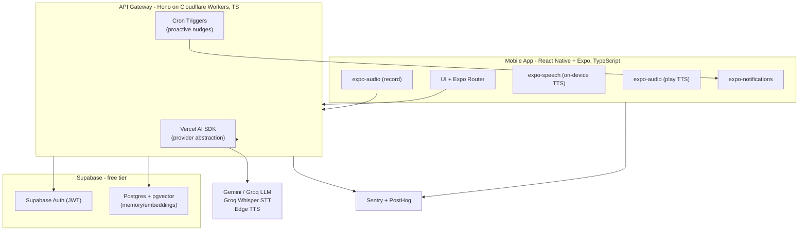

# Alter EGO — Technology Stack

JS/TypeScript-first stack for a cross-platform mobile app, maximizing free tiers with provider abstraction so vendors can be swapped later. Prices below are list rates as of mid-2026 and should be re-verified before launch.

See [PRD.md](./PRD.md) for functional requirements and phased build roadmap.

## 1. Recommended Free-Tier Stack (2026)

Goal: build and run the MVP at **$0/month** using free tiers.

### 1.1 LLM / Persona Engine

- **Primary:** Google Gemini 2.5 Flash (AI Studio free tier) — 1,500 requests/day, 15 RPM, ~1M tokens/min, no credit card, no expiry. Multimodal, large context. Best free volume baseline for chat and persona reasoning.
- **Low-latency / fallback:** Groq (Llama 3.3 70B or Llama 3.1 8B) — free, 30 RPM, sub-second responses via LPU hardware. Use for the voice path where latency matters most (NFR-1).
- **Strategy:** Gemini for chat + heavy reasoning; Groq for real-time voice turns; fall back between them on 429/rate-limit with exponential backoff.
- **Privacy note:** Gemini free tier may use prompts for training; Groq free tier states no training on data. Surface this in consent (FR-8.4 / NFR-5). For sensitive content, prefer Groq or upgrade to a paid/no-train tier.

### 1.2 Speech-to-Text (voice input)

- **Primary:** Groq-hosted Whisper large-v3 / turbo — generous free tier, no credit card, near-real-time, 99 languages, ~$0.02/hr if you later exceed free limits. Reuses the same Groq key as the LLM.
- **Alternatives:** AssemblyAI (free credits + free hours) or self-hosted faster-whisper (compute-only cost) if Groq limits bite.
- **Note:** free Whisper is chunked rather than true streaming; acceptable for push-to-talk. For lowest-latency streaming later, Deepgram Nova-3 ($200 signup credit) is the upgrade path.

### 1.3 Text-to-Speech (persona voice output)

The main free-tier constraint.

- **Cheapest ongoing ($0 forever):** native on-device TTS — iOS `AVSpeechSynthesizer` and Android `TextToSpeech`. Zero cost, offline, no quota; lower expressiveness. Good default for notifications and a budget voice.
- **Best free neural quality:** Microsoft Edge TTS — free, no API key, 300+ neural voices via community wrappers. Great quality-to-cost; treat availability as best-effort and have a fallback.
- **Cloud free tiers (premium persona voice within limits):** Google Cloud TTS 1M chars/month free, Azure Neural 500k chars/month free, AWS Polly 5M chars/month free (first 12 months only).
- **Strategy:** native TTS for notifications + offline; Edge TTS or a cloud free tier for the expressive "persona voice." Cache TTS audio for repeated notification copy (NFR-8) to stay within monthly char caps.

### 1.4 Backend, Auth, Data & Push

- **Auth + database + storage:** Supabase free tier (Postgres, Auth, storage, row-level security) or Firebase Spark (Auth + Firestore). Either covers FR-7 memory store and FR-8 accounts at $0 for MVP scale.
- **Push notifications (FR-6):** Firebase Cloud Messaging (FCM) — free and unlimited for both iOS and Android. Use device-local scheduled notifications for habit reminders to avoid server cost.
- **API gateway / server (to hide AI keys per NFR-4):** Cloudflare Workers free tier, or Render/Fly.io/Vercel free tier. Keep it stateless (NFR-3); never ship provider keys in the app.

### 1.5 Free-Tier Stack Summary

| Layer | Choice |
|-------|--------|
| LLM | Gemini 2.5 Flash (primary) + Groq Llama 3.3 70B (voice/fallback) |
| STT | Groq Whisper large-v3 |
| TTS | On-device (notifications/offline) + Edge TTS or cloud free tier (persona voice) |
| Auth/DB/Storage | Supabase or Firebase |
| Push | Firebase Cloud Messaging |
| Server/gateway | Cloudflare Workers (or Render/Fly.io/Vercel) free tier |

### 1.6 Free-Tier Risks & Mitigations

- **Rate limits (RPM/TPM/RPD):** real ceiling for multi-user usage; mitigate with provider fallback chain, request queueing, backoff, and aggressive response/TTS caching.
- **Quota changes:** free tiers shift often (Gemini cut quotas in late 2025); keep provider abstraction (NFR-10) so swapping is config-only.
- **TTS quality vs cost trade-off:** native TTS is free but robotic; expressive persona voice is the most likely first paid upgrade.
- **Commercial-use licenses:** verify each provider's free-tier terms permit commercial use before launch (some trial keys forbid it).

## 2. Complete Tech Stack (JS/TypeScript-first)

Chosen for a JS-expert solo/small team building a cross-platform mobile app, maximizing free tiers (section 1) and code reuse. Everything below is JS/TS end to end.

### 2.1 Frontend (mobile)

- **React Native + Expo (TypeScript)** — one JS codebase for iOS + Android, OTA updates, native modules without ejecting.
- **Navigation:** Expo Router (file-based).
- **Server state:** TanStack Query; **client state:** Zustand.
- **UI:** NativeWind (Tailwind for RN) or Tamagui; Reanimated for voice/animation polish.
- **Audio in/out:** expo-audio (record voice, play TTS streams), expo-speech (on-device TTS for the free/offline voice).
- **Notifications:** expo-notifications (local scheduled reminders + push handling).

### 2.2 Backend / API Gateway

- **Hono on Cloudflare Workers (TypeScript)** — tiny, fast, edge-deployed, generous free tier, native streaming (SSE) for token-by-token LLM and TTS. Keeps all AI provider keys server-side (NFR-4).
- **Vercel AI SDK** (`ai` package) for LLM calls — unified JS API across Gemini + Groq with built-in streaming, giving the provider abstraction in NFR-10 for free.
- **Proactive nudges (FR-6):** Cloudflare Cron Triggers fire scheduled jobs that compute nudges and send push; lightweight per-habit reminders stay device-local via expo-notifications.
- **Alternative:** Fastify or Hono on Render/Fly.io free tier if you prefer a long-running Node server.

### 2.3 Authentication

- **Supabase Auth** — email/password + OAuth (Google/Apple), JWT-based, official RN support, free tier. Covers FR-8.1 and integrates directly with Postgres row-level security.
- **Alternative:** Clerk (excellent RN DX, free tier) if you want drop-in UI components.

### 2.4 Database & Storage

- **Supabase Postgres (free tier)** for users, habits, goals, conversations, persona config (FR-1, FR-5, FR-8).
- **pgvector extension** for semantic memory/embeddings powering FR-7 (recall relevant past context).
- **Row-Level Security** so each user only reads their own data (NFR-4/NFR-5).
- **Supabase Storage** for cached TTS audio clips (NFR-8 cost caching).

### 2.5 Voice In (STT)

Capture with expo-audio on device, upload to the gateway, transcribe via Groq-hosted Whisper large-v3 (free tier, near real-time). Gateway returns transcript to the app and feeds the LLM.

### 2.6 Voice Out (TTS)

- **Free/offline + notifications:** expo-speech (on-device).
- **Expressive persona voice:** gateway calls Edge TTS (or a cloud free tier), streams audio back, app plays via expo-audio. Cache repeated clips in Supabase Storage.

### 2.7 Observability

- **Errors + performance:** Sentry (free tier) with both the React Native SDK and the Workers/Node SDK — crash reporting, traces, and LLM/voice latency spans (NFR-1, NFR-9).
- **Product analytics + funnels + feature flags:** PostHog (free tier) — track engagement, mode usage, habit/goal outcomes (NFR-9), and gate persona experiments (NFR-10 A/B).
- **Logs/uptime:** Cloudflare Workers logs + Better Stack (Logtail/uptime) free tier.

### 2.8 Tooling & Delivery

- **Language:** TypeScript everywhere; shared types package between app and gateway (monorepo via pnpm/Turborepo).
- **Validation:** Zod for API and LLM I/O schemas.
- **Builds/release:** Expo Application Services (EAS) free tier for iOS/Android builds and OTA updates.
- **CI:** GitHub Actions free tier (lint, typecheck, test, EAS build).
- **Testing:** Vitest/Jest + React Native Testing Library; Maestro for E2E mobile flows.

### 2.9 Stack Summary

| Layer | Technology |
|-------|------------|
| Frontend | React Native + Expo (TS), Expo Router, TanStack Query, Zustand, NativeWind, expo-audio, expo-speech, expo-notifications |
| Gateway/BE | Hono on Cloudflare Workers (TS) + Vercel AI SDK + Cron Triggers |
| Auth | Supabase Auth (or Clerk) |
| DB/Storage | Supabase Postgres + pgvector + Storage |
| LLM | Gemini 2.5 Flash + Groq (Llama 3.3 70B) |
| STT | Groq Whisper large-v3 |
| TTS | expo-speech (on-device) + Edge TTS / cloud free tier |
| Push | expo-notifications + FCM/APNs (Expo Push) |
| Observability | Sentry + PostHog + Better Stack |
| Delivery | EAS + GitHub Actions, pnpm/Turborepo monorepo |
